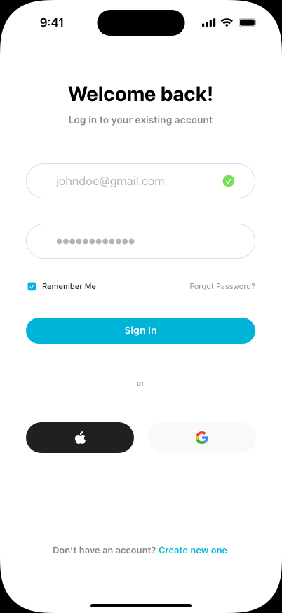

## Visual Concept

We used [Sketch](https://www.sketch.com/) to create the mockups for the DropIn application. The complete Sketch project file, `DropInMockUp.sketch`, is located in the `docs/client/` directory.

### Mockup Previews

Below are some previews of the application design:

**Sign In**

**For You Screen**

**Map Screen (Event Details)**
%20-%20Light.png)

**Create Event Screen**

**Chat List Screen**

**Chat Screen**

