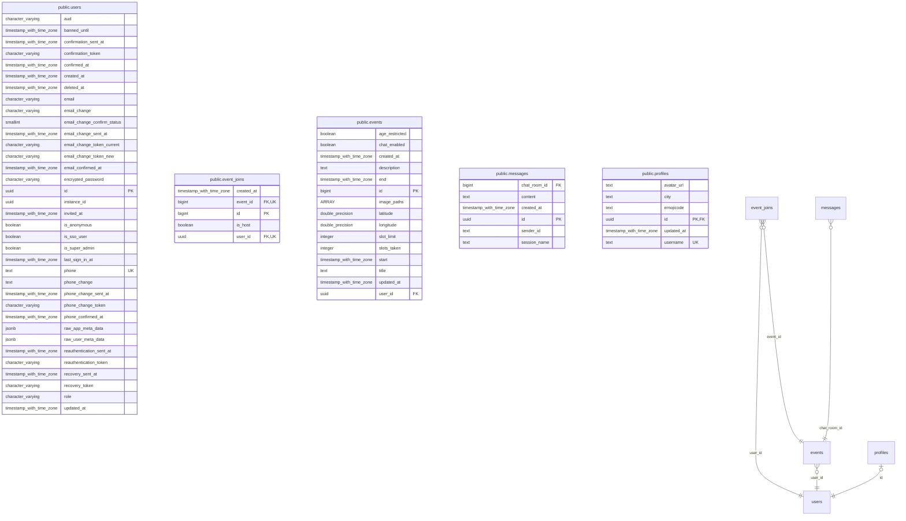

# Database Scheme

The following ERD shows the core tables used by DropIn.

We use the authentication service of Supabase, thus we use the ID Provided by the `auth.users` table to identify the user throughout the system.

For each DropIn user a 'profile' is created during the signup process. The profile contains general information about the user, like the path to their username, profile picture and more.

Events and participations in events are managed through the `events` and `event_joins` tables. The messages associated with the event are stored in the `messages` table.

Some things not visible in this diagram. There are tw constraints and functions which are enfored during changes and periodicaly (e.g. the cleanup of old events).

## Change Management
Changes to the database are managed through migrations. The migrations are small sql scripts which are automatically applied to the database during the startup of the docker container.

This behaviour is controlled in the Docker Compose file located at `server/docker`. The migrations themselves can be found in the `client/supabase/migrations` directory.